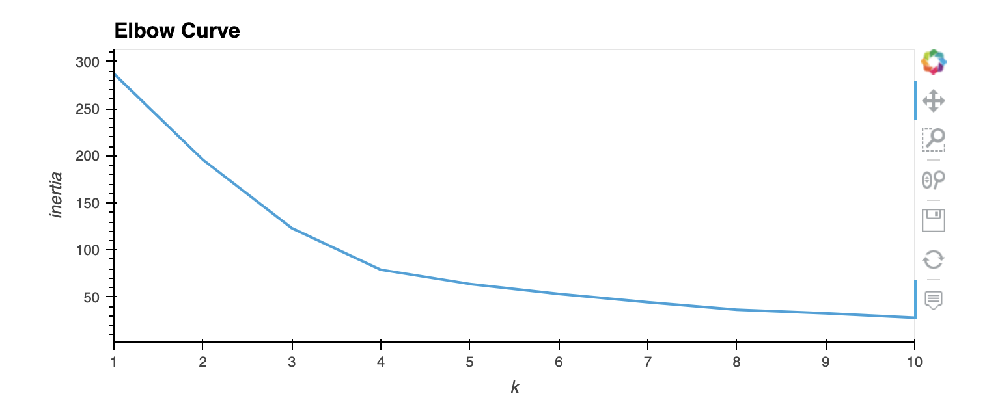
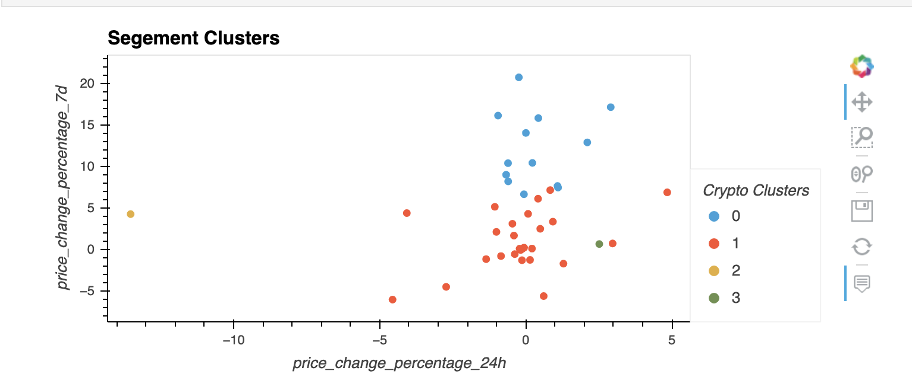
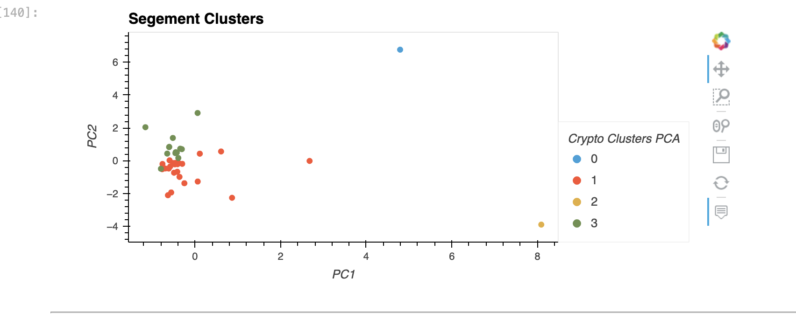

# Crypto Clustering

The project is based on creating a prototype to submit our crypto portfolio proposal by including other factors that might impact the crypto market—leading to better performance for our portfolio. Rather than basing our recommendation on only returns and volatility

## The steps followed in this project are :

* Import the Data (provided in the starter code)
* Prepare the Data (provided in the starter code)
* Find the Best Value for `k` Using the Original Data
* Cluster Cryptocurrencies with K-means Using the Original Data
* Optimize Clusters with Principal Component Analysis
* Find the Best Value for `k` Using the PCA Data
* Cluster the Cryptocurrencies with K-means Using the PCA Data
* Visualize and Compare the Results

## Installation:

To navigate through this project, you may need to install the following on your machine :
`Jupyter` - Running code
`Pandas` - Data analysis
`hvPlot` - Interactive Pandas plots

## Usage
First, make sure the following libraries are running properly:
* import pandas as pd
* import hvplot.pandas
* from pathlib import Path
* from sklearn.cluster import KMeans
* from sklearn.decomposition import PCA
* from sklearn.preprocessing import StandardScaler*

Second, click on the play icon on the toolbar of the Jupyter lab to start

# Exemples :

## Contributing
[karim bouzina](https://www.linkedin.com/in/karim-bouzina-574348244/)

## License

UW Fintech
2022 edX Boot Camps LLC